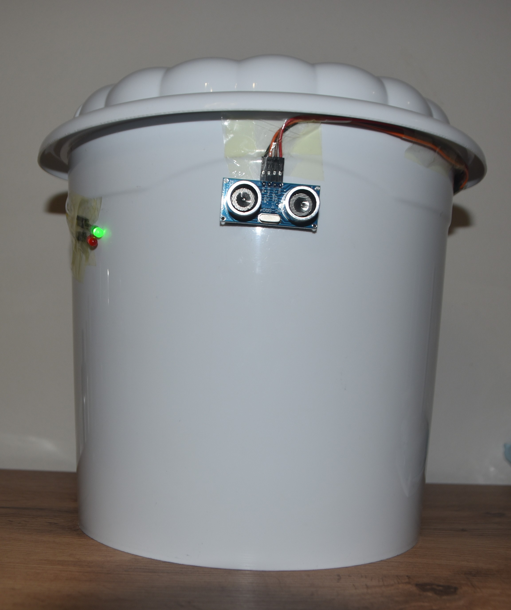
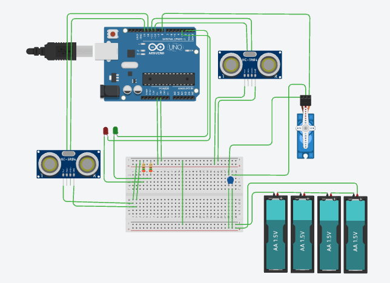

# Smart Bin 🗑️

**Arduino-based touchless waste management system**

  

    
     <i>Figure 1: Smart Bin Prototype</i>

---

## Table of Contents 📑

- [Description 📝](#description)
- [Features ✨](#features-)
- [Components Used 🛠️](#components-used)
- [Working Principle ⚙️](#working-principle)
- [Circuit Diagram 🔌](#circuit-diagram-)
- [Software Requirements 💻](#software-requirements-)
- [Installation & Setup ⚡](#installation--setup-)
- [Applications 🌍](#applications-)
- [Future Improvements 🚀](#future-improvements-)
- [Authors 👤](#authors-)
- [License 📄](#license-)

---

## Description

The **Smart Bin** is an Arduino-based project that automatically opens a dustbin lid when a person approaches and can monitor the garbage level inside.  
It promotes hygiene by reducing physical contact and supports smart waste management.

The system uses ultrasonic sensors to detect motion and measure the fill level of the bin, making it suitable for homes, schools, offices, and smart city applications.

---

## Features ✨

- Automatic lid opening using a servo motor
- Touchless operation using ultrasonic sensors
- Garbage level detection
- Low-cost and easy to build
- Improves hygiene and cleanliness

---

<h2 id="components-used">Components Used 🛠️</h2>

| Component                       |
| ------------------------------- |
| Arduino UNO                     |
| Breadboard                      |
| 2 x Ultrasonic Sensor (HC-SR04) |
| Servo motor                     |
| 9V battery (Arduino)            |
| 5V Powerbank (Servo)            |
| 2 x LED (Red & Green)           |
| Capacitor (400µF)               |
| 2 x Resistor (220Ω)             |

---

<h2 id="working-principle">Working Principle ⚙️</h2>

1. The **outer ultrasonic sensor** continuously monitors for an object (hand or person) near the bin.
2. When the detected distance is less than **10 cm**, the Arduino activates the servo motor.
3. The servo motor opens the lid automatically and keeps it open for **4 seconds**.
4. An **inner ultrasonic sensor** measures the garbage level inside the bin.
5. If the measured distance is less than **15 cm**, the bin is considered full and the lid will not open.
6. When the bin is available for use, the **green LED** glows; when the bin is full, the **red LED** glows.

---

## Circuit Diagram 🔌

    
     <i>Figure 2: Smart Bin Circuit Diagram</i>

---

## Software Requirements 💻

- [Arduino IDE](https://www.arduino.cc/en/software)

---

## Installation & Setup ⚡

1. Download and install the Arduino IDE.
2. Connect the Arduino Uno to your computer.
3. Assemble the circuit according to the diagram above.
4. Open the Arduino sketch file (`.ino`).
5. Select the correct board and port in the Arduino IDE.
6. Upload the code to the Arduino.

---

## Applications 🌍

- Smart homes
- Public dustbins
- Offices and schools
- Smart city waste management

---

## Future Improvements 🚀

- Add **IoT support** (WiFi/GSM) for remote monitoring
- **Mobile app notifications** when bin is full
- **Solar-powered charging** for sustainability
- **AI-based waste sorting** for recycling

---

## Authors 👤

**Alden Čamdžić**  
**Ahmed Halilović**  
**Bakir Efendić**

---

## License 📄

<i>This project is open-source and free to use for educational purposes.</i>
